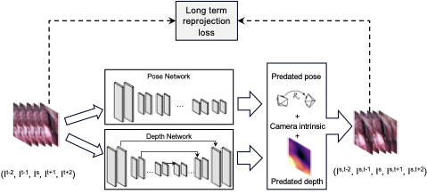

## Pipeline
<p align="center">
 
</p>

## Requirements
torchvision 0.12.0, CUDA 10.2, tensorboardX 1.4 

If you're using older version of torchvision, you need to: 
- be careful with `align_corners=True` using `F.interpolate` and `F.grid_sample` to garentee a good camera trajectory, as these methods has been changed to use `align_corners=False` by default in later version.
- replace `transforms.ColorJitter()` with `transforms.ColorJitter.get_params()`.

## Dataset
The dataset is available on the [SCARED official website](https://endovissub2019-scared.grand-challenge.org).

## Date preprocess
```shell
ffmpeg -i /path/to/rgb.mp4 -filter:v "crop=1280:1024:0:0" /path/to/crop_rgb.mp4
ffmpeg -i /path/to/crop_rgb.mp4 %6d.jpg
```

## Training
```shell
CUDA_VISIBLE_DEVICES=1 python train.py --data_path <path/to/SCARED/> --log_dir <path/to/save/weights>  --batch_size 20 --frames_ids -2 -1 0 1 2
```

## Validation
```shell
CUDA_VISIBLE_DEVICES=1 python evaluate_depth.py --load_weights_folder <weights_path> --eval_mono  --eval_split endovis --data_path </path/to/SCARED> --max_depth 150.0
CUDA_VISIBLE_DEVICES=1 python evaluate_pose.py --data_path <path/to/SCARED/> --eval_split endovis --load_weights_folder <weights_path>
```

## Testing
| Model        | Abs Rel | Sq Rel | RMSE | RMSE log | Link |
| ------------ | ---------- | ------ | --------- | ---- | ---- |
| Results | 0.071 | 0.596 | 5.608 | 0.095 | [google drive](https://drive.google.com/file/d/1r6QRf7ZGconNBuBit9CK3Rr-3slQ9toq/view?usp=sharing)| 

```shell
CUDA_VISIBLE_DEVICES=1 python test_simple.py --model_path <model_path> --image_path <image_path>
```


## Colab Demos

- [Colab] (Long_Term_Reprojection_Loss.ipynb): Visualise the output of the dataloader. Calculate the depth and pose metrics and visualise trajectory using pretrained weights.

<p float="left">


</p>

## Acknowledgement

Our code is built on top of the implementation of [Monodepth2](https://github.com/nianticlabs/monodepth2).
